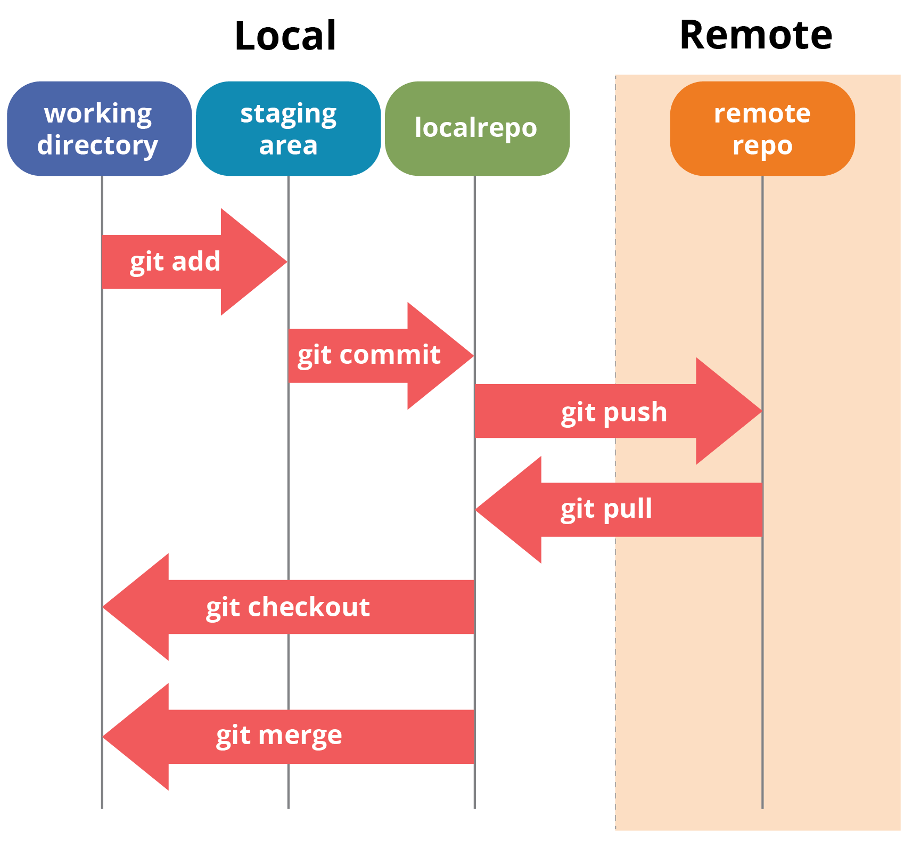

# git

- [git](#git)
  - [git 이거만 알자](#git-이거만-알자)

## git 이거만 알자



깃이 관리하는 프로젝트를 **Repository(레포/repo)**라 하고
자신의 컴퓨터에 있는 코드가 **Local** 깃허브에 있는 코드를 **Remote 레포(Repository)**라고 부릅니다.

꼭 알아야 되는 5개 Git 동작:

1. `add`: 컴퓨터 상 변경사항을 git에 추가하는 것. 파일 단위이고 전부 추가하는 명령어는 

```bash
git add .
```

**중요파일이 올라갈 수 있으니 `.env` 파일이나 기타 민감한 파일은 `.gitignore` 설정!**

2. `commit`: git에 추적되고 있는 파일을(`git add`로 staging 추가된 파일) 컴퓨터 상 **로컬 repo에 추가**. 메시지는 뭔 내용을 했는지 알아볼 수 있도록 해주세요! e.g, 끝냈다!->X, SQL 쿼리 한 줄 추가했습니다->O

```bash
git commit -m "React 로그인 버튼 컴포넌트 추가"
```

3. `push`: 로컬(자기 컴퓨터) repo에 commit된 내용을 remote repo(깃허브)로 전송.


```bash
// main으로!
git push origin main
// 자기 branch로 push
git push origin <자기-branch-이름>
```

4. `pull`: `push`의 반대. **GitHub repo의 내용을 컴퓨터 repo로 가져옴**. `fetch`에 더해 자동으로 `merge`(서로 충돌되는 내용이 있으면 합침) 해줍니다!

```bash		
git pull
```

5. `checkout`: `branch` 변경. `main`과 다른 `branch`를 오고 갑니다. `branch` 옮기기 전 저장하기! `-b` 플래그는 `branch`가 존재하지 않을시 생성 후 바꿉니다.

```bash
git checkout main
git checkout <자기-branch-이름>
git checkout -b <만들고-checkout할-branch>
```