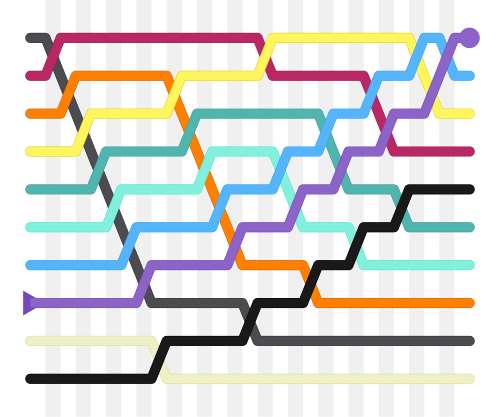
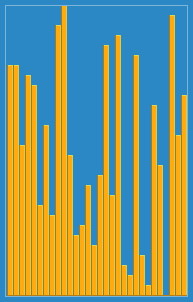

# algorithms

- [algorithms](#algorithms)
  - [sort (정렬)](#sort-정렬)
    - [bubble sort](#bubble-sort)
    - [merge sort](#merge-sort)
    - [quick sort](#quick-sort)
    - [insertion sort](#insertion-sort)
    - [heap sort](#heap-sort)

알고리즘은 데이터에 작업을 해 결과를 내는 단계적 절차입니다.

**개념과 시간 복잡도** 로 정리하겠습니다. 

참고: 알고리즘 설명 시 Pseudo code를 사용하는 것은 특정 언어의 문법이 아닌 logic에 집중하기 위해 자유롭게 흐름과 개념, 어떻게 구현할지 구조를 설명하시면 됩니다.

## sort (정렬)

정렬은 가장 기초적이고 많이 쓰이는 알고리즘 종료입니다.

인터뷰시 가장 많이 나올 sorting 알고리즘 5가지를 위주로 알아보겠습니다.

참고 :시간이 없고 문제 해결 시 **사용만을 원할 시 [merge sort](#merge-sort)**, 질문시 한 번 **비교 정도는 하고 싶다면 [quick sort](#quick-sort)까지**만 보셔도 됩니다.

### bubble sort



**[Bubble sort](https://en.wikipedia.org/wiki/Bubble_sort)는 input 받은 리스트를 돌면서, 현재 값을 다음 값과 비교하면서, 필요시 둘의 값을 swap(교체)하는 것입니다.**. 이 작업을 리스트가 더 이상 swap이 필요 없을때까지 반복합니다. 

**Worst case 시간복잡도는 비교와 swap(교체) 모두 `O(n^2)`입니다.**

- 참고1: 인터뷰에서 **Merge sort와 quick sort 대신 쓸 이유는 일반적으로 없고** 공간복잡도(메모리 이용량)가 `O(1)` 라는 것이 이득이기는 하나 시간 복잡도가 `O(n log n)`인 Merge Sort나 실무 시 그 보다 빠른 경우가 잦은 quick sort로 대체됩니다.
- 참고2: Sinking sort라고도 불립니다

아래는 위키피디아의 bubble sort의 pseudo 코드(실제 언어가 아닌 로직만 나타내기 위함)입니다:
```
procedure bubbleSort(A : list of sortable items)
    n := length(A)
    repeat
        swapped := false
        for i := 1 to n-1 inclusive do
            { if this pair is out of order }
            if A[i-1] > A[i] then
                { swap them and remember something changed }
                swap(A[i-1], A[i])
                swapped := true
            end if
        end for
    until not swapped
end procedure
```

### merge sort


**[Merge sort](https://en.wikipedia.org/wiki/Merge_sort)는 가장 흔히 쓰이는 comparison(비교) 기반 sorting 알고리즘** 중 하나입니다. 대부분의 구현 방식은 [`stable`](https://en.wikipedia.org/wiki/Sorting_algorithm#Stability)을 사용합니다.

Merge sort는 **Divide and Conquer**(분할 정복) 기반 알고리즘의 대표격으로 다음과 같이 작동합니다:

1. Sort(정렬)되지 않은 리스트를 n개의 sub-list로 나눕니다. (Element가 한 개 뿐인 리스트는 sort 되었다 여깁니다.)
2. 반복적으로 리스트를 합치며 새로운 sort(정렬)된 리스트를 만들며 1개의 sublist만이 남을 때까지 이를 반복합니다.

이와 같이 **큰 문제 덩어리를 작은 덩어리로 나눈 후 합치는 것을 반복하는 것을 Divide and Conquer** 기반 방식이라 합니다. **Recursion의 경우 merge sort 등을 해결하기 위한 프로그래밍 기술로 function(함수)가 자기 자신을 부르는 것입니다.** 2개의 sublist를 sort하는 것은 해당 sublist들이 이미 sort된 상태라면 Linear time(`O(n)` 시간복잡도)에 해결 될 수 있으므로 효율적인 방식입니다.

**Worst case 시간복잡도는 `O(n log n)`입니다.**. 때문에 **최악의 경우에도 가장 안정적**으로 사용 가능한 sort 중 하나입니다.

### quick sort


**[Quick sort](https://en.wikipedia.org/wiki/Quicksort)는 **

**Worst case 시간복잡도는 `O(n^2)`이지만 실제로는 merge sort보다 빠른 경우가 많습니다..**

### insertion sort



**[Insertion sort](https://en.wikipedia.org/wiki/Insertion_sort)는 간단한 sorting 알고리즘으로 **

### heap sort


**[Heap sort](https://en.wikipedia.org/wiki/Heapsort)는 비교 기반의 sorting 알고리즘**으로