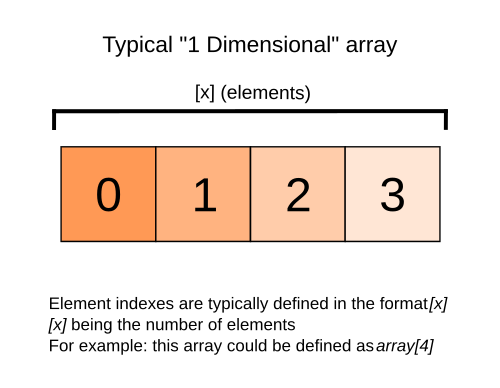
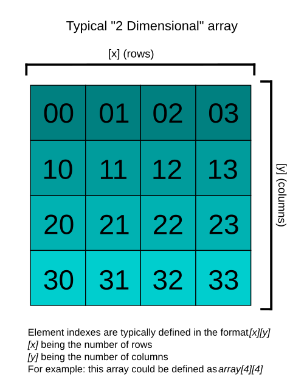
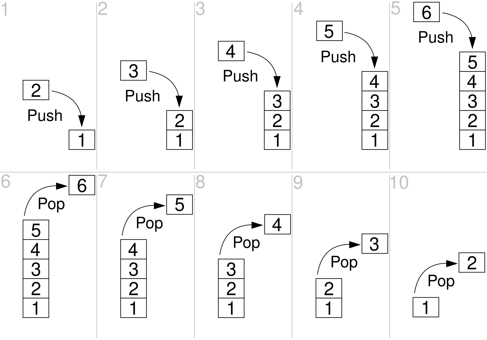
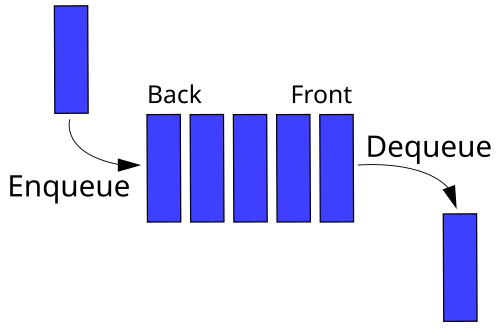
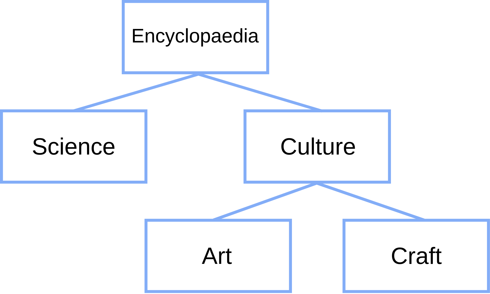
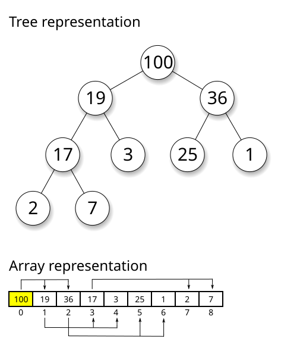
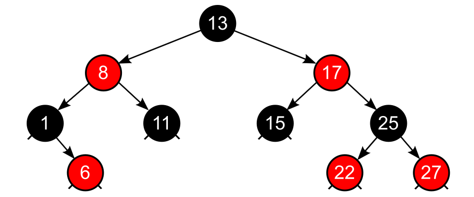
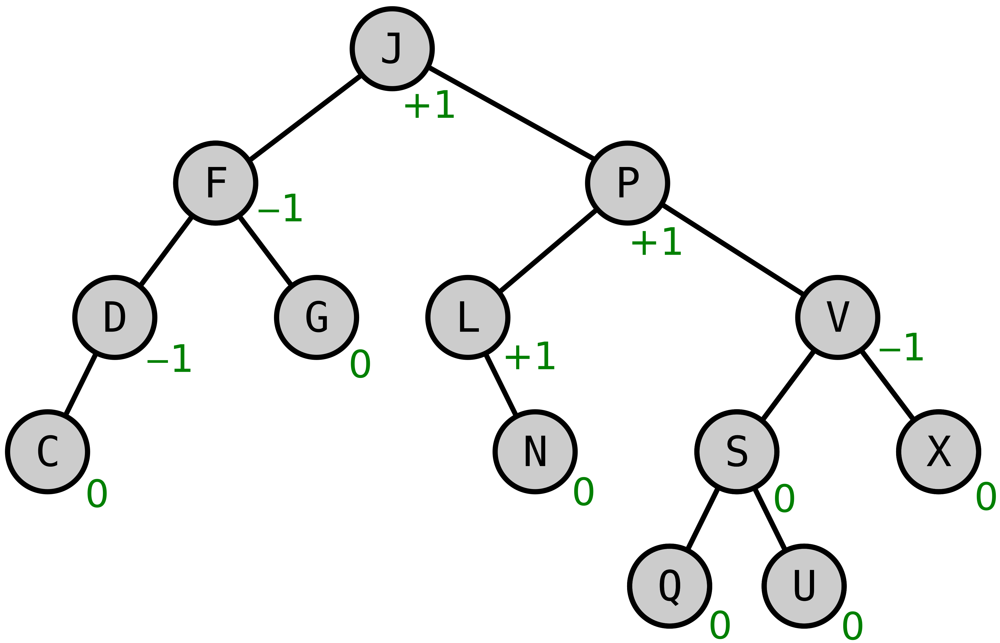
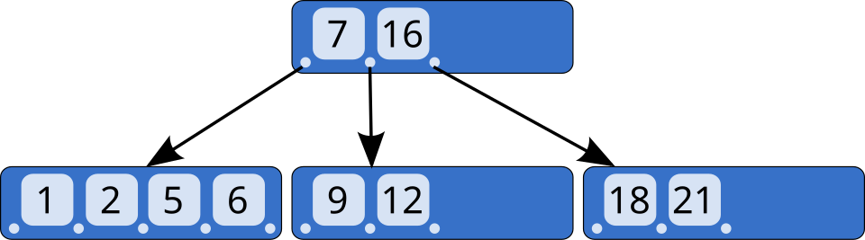
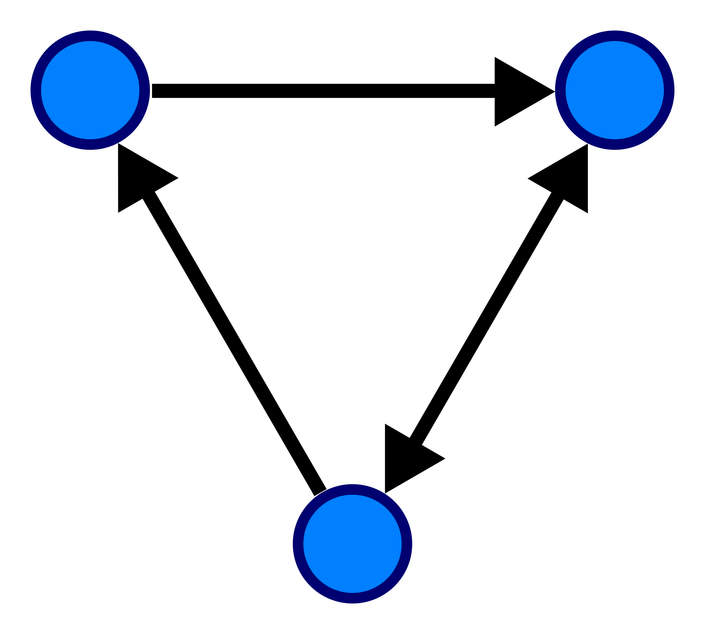

# data structures

- [data structures](#data-structures)
  - [Complexity (복잡도)](#complexity-복잡도)
    - [Time Complexity (시간 복잡도)](#time-complexity-시간-복잡도)
    - [Space Complexity (공간 복잡도)](#space-complexity-공간-복잡도)
  - [Array](#array)
  - [ADT (Abstract Data Type)란](#adt-abstract-data-type란)
  - [List](#list)
    - [Linked List](#linked-list)
  - [Set](#set)
  - [Stack](#stack)
  - [Queue](#queue)
  - [Tree](#tree)
    - [binary tree](#binary-tree)
    - [Heap](#heap)
    - [Self Balancing Binary Search Tree](#self-balancing-binary-search-tree)
    - [R-B(Red-Black) Tree](#r-bred-black-tree)
    - [AVL Tree](#avl-tree)
    - [B-Tree](#b-tree)
  - [Map](#map)
    - [Hash Map](#hash-map)
  - [Graph](#graph)

비전공자여도 프로그래밍 시 데이터 구조의 기본을 모르면 `Map`과 같은 라이브러리를 필요할 때 사용하기 힘듭니다. 사칙연산 수준의 수학만으로 간단히 개념만 잡고 가겠습니다.

`for` loop 안에 `for` loop를 넣었는데 너무 느리다, 사람들 정보를 저장하고 검색해보고 싶은데 어떻게 해야 되지? 등이 궁금하시다면 Data structure를 알아야 합니다.

## Complexity (복잡도)

데이터 구조를 분석하기 위해선 간단히 [Complexity](https://en.wikipedia.org/wiki/Computational_complexity) (복잡도란)에 대해 알아야 합니다.

알로기즘의 complexity란 그걸 실행하기 위해 필요한 리소스(자원)의 양을 말합니다.

지금 알아야 할 건 **Big O notation(`O()`)뿐**입니다. `O(1)`, `O(n)`, `O(n logn)`, `O(n^2)` 등으로 표현 되며 여기서 n은 데이터의 양을 의미합니다. Big O의 경우 최악의 상황을 가정하는 것입니다. 

Worst Case(최악), Average Case(평균적), Best Case(최선의 경우)를 간단히 예로 들면:

- 진짜 잘 풀리면 로또 사자마자 당첨 가능! -> Best Case
- 아마 100명 랜덤으로 돌리면 50번쯤에 배정되지 않을까 -> Average Case
- 회사 지원자 10001명 중 10000명 뽑는데 10001등이야! -> Worst Case

우리는 알고리즘의 잘 풀릴때에 관심 있는게 아니라 최악의 경우 어떻게 작동할지를 원하므로 Worst Case를 표현하는 Big O를 대부분의 경우 사용합니다.

참고: Big O, small o, big omega, small omega 등 다양한 notation이 있습니다.

Data structure의 경우 일반적으로 Search/Retrieval(검색), Insert(추가), Delete(삭제)시의 Complexity를 분석하곤 합니다.

### Time Complexity (시간 복잡도)

**걸리는 시간**을 기준으로 algorithm의 complexity를 계산한 것입니다. 일반적으로 complexity를 계산할 때 사용하는 기준입니다.

예를 들어 0~n의 `for` loop를 1번 돌리면 n번의 iteration을 진행하니 `O(n)`, 2번 nesting 해서 돌리면 `O(n*n)==O(n^2)`, 3번 하면 `O(n^3)`.

### Space Complexity (공간 복잡도)

**필요한 메모리**를 기준으로 algorithm의 complexity를 계산한 것입니다.

중요하기는 하나 메모리가 부족한 경우가 아니라면 (e.g, 임베디드, 초거대 데이터 계산) 대부분의 경우 메모리를 덜 쓰고 1시간 걸리는거보다 10초만에 작업이 끝나는 걸 선호합니다. 

따라서 흔히 complexity를 계산한다고 할 때 time complexity를 위주로 보며 space complexity는 참고 자료 정도로 쓰이는 정도입니다.

## Array

[Array](https://en.wikipedia.org/wiki/Array_(data_structure))는 `index`(순서)나 `key`(키로 검색) 중 하나 이상으로 구분되는 **동일한 메모리 사이즈**의 value의 모음입니다. 뒤에 나오는 ADT와는 다르게 물리적인 메모리 상의 data structure입니다. 일반적인 경우 `index`의 시작은 `0`입니다.

가장 간단한 Array는 linear(선형/1차원) Array입니다. 다차원 Array 조작 시 vector와 matrix 등의 지식이 큰 도움이 될 수 있습니다.

엄밀한 수학적 정의와는 다르지만 1차원 array는 **vector**, 2차원 array는 **matrix**, 3차원 이상의 array는 **tensor** 등으로 부르기도 합니다.

## ADT (Abstract Data Type)란

ADT는 실제 컴퓨터의 메모리를 잡아먹는 것이 아닌 abstract(추상적)으로 정의된 데이터 타입을 의미합니다.

예를 들어 Hash Map이란 ADT를 Java에서는 `HashMap`으로 구현합니다.

## List

[List](https://en.wikipedia.org/wiki/List_(abstract_data_type))혹은 Sequence는 어떠한 **order(순서)가 있으며 유한**한 아이템의 collection입니다. List ADT는 수학적으로 tuple에 해당합니다 (Python Tuple은 Python List와 다름!)

### Linked List

**[Linked List](https://en.wikipedia.org/wiki/Linked_list)는 물리적으로 메모리에서 인접하지 않은 데이터를 연결한 것입니다.**

한 방향으로 연결되면 **Singly Linked List**, 연결이 양방향이라면 **Doubly Linked List**라고 합니다.

## Set

**[Set](https://en.wikipedia.org/wiki/Set_(abstract_data_type))는 order(순서) 없이 서로 다른 value를 저장할 수 있는 ADT입니다** (Java의 `TreeSet`등은 순서가 있음)

일반적으로 검색 용도보다는 특정 **value가 set에 속하는지 membership test를 하기 위해 사용**됩니다.

## Stack

[Stack ADT](https://en.wikipedia.org/wiki/Stack_(abstract_data_type))는 order(순서)가 있는 아이템의 모음으로 다음의 2가지 주요 기능을 가지고 있습니다:

1. **Push**: 맨 위에 아이템 추가
2. **Pop**: 가장 최근 추가(맨 위)된 아이템 제거

**Stack은 LIFO(Last In Last Out)입니다.**

책이 쌓여 있다고(Stacked) 생각해 봅시다. 맨 위에 쌓인 책이 맨 먼저 나갑니다.

## Queue

[Queue ADT](https://en.wikipedia.org/wiki/Queue_(abstract_data_type))는 order(순서)가 있는 아이템의 모음으로  다음의 2가지 주요 기능을 가지고 있습니다:

1. **Enqueue**: 맨 뒤에 새 아이템 추가
2. **Dequeue**: 맨 앞의 아이템 제거

**Queue는 FIFO(First In First Out)입니다.**

식당에서 줄을 서 있다고(Queued) 생각해 봅시다. 먼저 들어온 사람이 먼저 서빙 받습니다.

## Tree

**[Tree](https://en.wikipedia.org/wiki/Tree_structure)는 hierarchical(수직적인) 구조를 표현**하는 방식입니다.

- 각각의 key(value)를 담고 있는 것을 Node라고 부릅니다.
- 최상위에 있는 Node를 **root**라고 부릅니다
- 최하단의 Node를 **leaf**라고 부릅니다.
- Tree의 한 단계를 내려갈 수록 **depth**가 1씩 올라갑니다. (Root는 0)
- Tree를 한 단계씩 올라갈 수록 **height**가 1씩 올라갑니다. (Leaf이 0)

### binary tree

**[Binary Tree](https://en.wikipedia.org/wiki/Binary_tree)는 하나의 Node가 최대 2개의 Child를 가지고 있는 Tree입니다**.

한 노드의 child는 각각 `left child`, `right child`로 불리며 **`k=2`인 k-ary Tree**입니다.

### Heap

**[Heap](https://en.wikipedia.org/wiki/Heap_(data_structure))이란 Tree기반의 구조로 heap 속성을 가지고 있습니다**

1. `max heap` ADT의 경우 parent(부모) Node는 항상 child(자식) Node보다 value가 크거나 같습니다.

2. `min heap` ADT의 경우 parent(부모) Node는 항상 child(자식) Node보다 value가 작거나 같습니다.

### Self Balancing Binary Search Tree

**[Self Balancing Binary Search Tree](https://en.wikipedia.org/wiki/Self-balancing_binary_search_tree)는 무작위 insertion(추가)와 deletion(삭제)시 height(깊이)를 최소화하는 Binary Tree의 총칭입니다**

예시로는 AVL, R-B Tree등이 있습니다. 

### R-B(Red-Black) Tree

**[Red-Black Tree](https://en.wikipedia.org/wiki/Red%E2%80%93black_tree)는 self-balancing binary tree**로 정보의 저장과 retrieval(가져오기)이 빠릅니다. 각 Node는 빨강/검정의 속성을 추가로 가지고 있으며 이를 이용해 tree가 적절히 균형(subtree간 차이가 최대 2배까지 차이 남) 잡힐 수 있도록 합니다. Binary Search Tree의 성질에 더해 다음이 충족되어야 R-B Tree입니다:

1. 모든 node는 Red 혹은 Black입니다.
2. 모든 null node는 Black입니다. (모든 모든 말단 부분에 Black인 NIL Node가 붙어있다 가정)
3. Red node는 red를 child로 가질 수 없습니다.
4. 한 node에서 아무 leaf node로의 path(경로)는 같은 숫자의 black node를 거쳐야 합니다.
5. 어느 node가 child node가 1개뿐일 경우 해당 child는 red여야 합니다. (black 인 경우 2와 4가 서로 위배됨)

**R-B Tree는 Search, Insertion, Deletion 모두 `O(log n)`입니다**

Worst case `O(log n)`을 보장하므로 다른 Worst Case 보장이 필요한 대이터 structure나 실시간 앱등에 쓰입니다. AVL Tree보다 조건이 덜 엄격(최대 2배차이 vs 1차이)여서 전반적으로 더 빠릅니다.

모든 perfectly balanced binary tree는 R-B Tree라 볼 수 있습니다.

재밌는 구조니 시간 나시면 위 위키피디아 참고하세요

### AVL Tree

**[AVL Tree](https://en.wikipedia.org/wiki/AVL_tree)는 한 node의 subtree간의 height 1까지 허용되는 Self-balancing binary search tree**입니다. 만약 2 이상 차이가 나게 된다면, tree는 rebalancing 되게 됩니다. R-B Tree와 자주 비교됩니다.

**AVL Tree는 Search, Insertion, Deletion 모두 `O(log n)`입니다.**'

AVL 역시 Red/Black으로 Node를 칠할 수 있으며 이 경우 R-B Tree의 성질을 충족 가능(R-B Tree의 subset)합니다.

### B-Tree

**[B-Tree](https://en.wikipedia.org/wiki/B-tree)는 data의 sort(정렬)를 유지하며 self-balancing하는 tree**입니다. Binary Search Tree를 일반화해 2개 이상의 child를 가질 수 있습니다.

DB와 파일 시스템 등에 많이 쓰이는 구조입니다. DB등에 사용시 한 Node가 엄청난 수의 Child를 가지며 depth를 낮게 유지하곤 합니다.

**B-Tree는 Search, Insert, Delete 모두 `O(log n)`입니다.**

## Map

**[Map](https://en.wikipedia.org/wiki/Associative_array)은 key/value pair(쌍)을 저장하는 ADT입니다.**

**Dictionary**(파이썬 등), **key-value store**(key와 value쌍으로 보관하는 성질), associative array(수학적인 정의), symbol table(컴파일러/시스템 수준에서 쓰이는 말) 등으로도 불립니다.

- 참고: Store(또는 data store)라는 표현을 자주 보게 될텐데 말 그대로 데이터 저장 공간을 의미합니다. Object나 Data Structure(Map, Array...), DB(SQLite, PostgreSQL, MongoDB, Redis 등), LocalStorage/SessionStorage(브라우저) 등의 다양한 데이터 스토리지 등을 말합니다.

Map의 경우 메모리를 써서 Time Complexity를 줄인다 생각하면 편합니다.

### Hash Map

**Hash function은 무작위 크기의 데이터를 정해진 사이즈의 value로 map할 수 있는 function 입니다**(일부는 정해진 사이즈가 아니라 value의 길이가 다를 수도 있습니다.). 예를 들어 100GB짜리 영상파일과 1KB짜리 문서를 똑같이 100자리 binary 값으로 mapping하는 function이 hash function입니다.
**hash value는 hash function을 통해 생성된 값을 말합니다**

**일반적인 경우 Hash Map은 Search, Insert, Delete의 complexity가 O(1)입니다.** 하지만 순서(order)가 없기에 범위 지정이나 기타 순서가 필요한 경우 Tree 구조나 다른 Map이 나을 수 있습니다.

**Hash Collision(충돌)의 경우 `O(n)`까지** Time Complexity가 갈 수 있으나 현대적인 Hash Map의 경우 이를 방지하기 위해 여러 장치가 되어 있습니다.

많은 경우 비효율적인 **Nested Loop**의 좋은 대안이 됩니다.

## Graph

**[Graph](https://en.wikipedia.org/wiki/Graph_(abstract_data_type))는 수학의 undirected graph(화살표/방향이 없는 그래프)와 directed graph(방향이 있는 그래프)를 구현하기 위한 ADT**입니다.

Graph의 경우 다음과 같은 요소가 있습니다:

- `vertice`: `node`나 `point`라고도 합니다.
- `edge`: `vertice` 2개의 쌍으로 표현되는 선입니다.