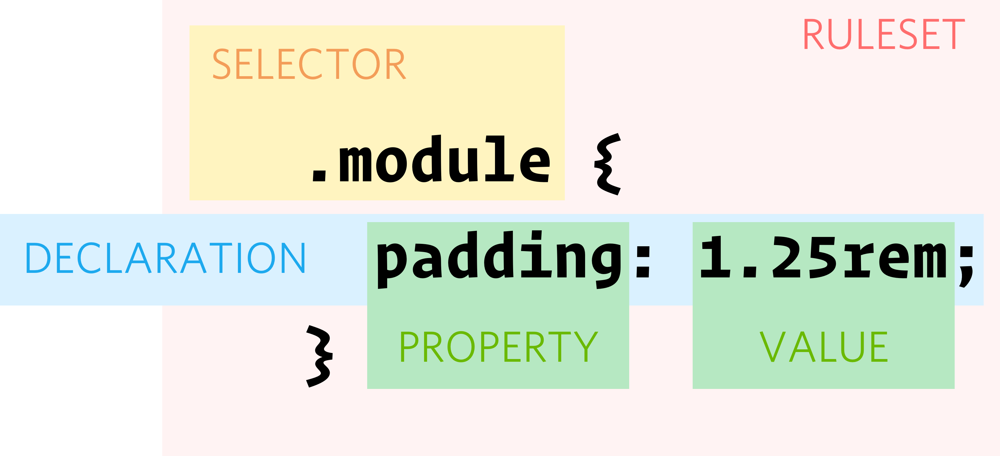

# css

- [css](#css)
  - [기초](#기초)
    - [ruleset](#ruleset)
    - [html에 css 적용하기](#html에-css-적용하기)
    - [casacade](#casacade)
    - [inheritance (상속)](#inheritance-상속)
  - [box model](#box-model)
    - [border](#border)
    - [margin](#margin)
    - [padding](#padding)
    - [document 레이아웃](#document-레이아웃)
    - [positioning](#positioning)
  - [selectors](#selectors)
    - [combinator](#combinator)
    - [chaining selector](#chaining-selector)
    - [attribute selector](#attribute-selector)
  - [text styling](#text-styling)
    - [font](#font)
    - [text handling](#text-handling)
    - [list and table styling](#list-and-table-styling)
    - [text decoration](#text-decoration)
  - [background](#background)
    - [gradation](#gradation)
  - [responsive(반응형) web](#responsive반응형-web)
    - [media query](#media-query)
  - [flexbox](#flexbox)
  - [grid](#grid)
    - [grid templates](#grid-templates)
  - [pseudo class (가상 클래스)](#pseudo-class-가상-클래스)
    - [responsive classes](#responsive-classes)
    - [status classes](#status-classes)
    - [document structure classes](#document-structure-classes)
    - [logical classes](#logical-classes)
    - [pseudo elements](#pseudo-elements)
  - [CSS Functions(함수)](#css-functions함수)
    - [css variables](#css-variables)
    - [math functions](#math-functions)
    - [visual functions](#visual-functions)
  - [transform](#transform)
  - [transition](#transition)
  - [animation](#animation)

## 기초

HTML이 문서의 구조를 짜기 위한 언어라면 CSS는 문서에 스타일을 주고 레이아웃 등을 짜기 위한 언어입니다.

### ruleset

CSS에서 Selector(선택자)와 `{`와 `}` 를 합쳐 Ruleset(또는 Rule)이라 합니다.



Ruleset 내의 `property` `value`쌍은 `declaration`이라고 부르며 세미콜론(`;`)으로 끝나야 합니다.

### html에 css 적용하기

1. Inline 스타일: `<body>` 내에서 직접 스타일 조작. 나쁜 습관이므로 되도록 쓰지 마십시오
2. Internal 스타일 시트: `<head>`에 `<style>` 태그 사이에 CSS를 정의한 것입니다. 역시 좋은 습관은 아닙니다.
3. External 스타일 시트: `<link >

### casacade

Styelsheet이 Cascade한다는 말은 기원과 CSS의 순서가 중요하다는 말입니다.

CSS 적용 우선순위 간단히(상세히는 점수제 알고리즘임):

1. `!important` flag: 우선순위 #1. 되도록 쓰지 말기
2. Origin (기원)
   1. 
3. Specificity (세부적일 수록 우선순위 높음)
   1. `ID Selector`: 가장 세부적, 가장 우선됨
   2. `Class Selector`: 2순위
   3. `Type(Element) Selector`: `<div>` 등의 HTML Element
   4. 아무것도 없으면 위보다 순위 낮음
4. 순서: Specifity까지 같다면 뒤에 오는 rule을 사용함

CSS 적용 알고리즘에 대해 자세히 아시고 싶으면 [CSS Handling Conflicts](https://developer.mozilla.org/en-US/docs/Learn_web_development/Core/Styling_basics/Handling_conflicts) 참고.

### inheritance (상속)

Child(자식) Element는 Parent(부모)의 property를 inherit (상속)합니다. `color`나 `font-family`를 부모에 설정해 뒀으면 자식 역시 그를 상속 받습니다.

모두 그런것은 아닙니다. `width`를 `50%`로 해뒀다고 그 Child Element가 parent의 `50%`씩 줄어드는것은 아닙니다.

아래와 같은 property는 inheritance를 관리하며 모든 CSS Property에서 사용가능합니다. [inheritance 예시](./css/)

- `inherit`: 부모 Element의 property로 설정
- `initial`: 브라우저 스타일 무시, CSS 기본(initial/default) 값으로 되돌림
- `revert`: 브라우저 기본 값으로 되돌림
- `revert-layer`: 최근 나온 layer 단위로 돌아가는 property
- `unset`: 기본값으로 reset

`revert`은 브라우저의 기본값으로, `unset`은 설정된 property는 초기화 하지만 부모로부터 inherit는 받음

## box model

한마디로, CSS에서는 모든게 주위에 박스가 있다는 말입니다. 크게 `block box`와 `inline-box`로 나뉘며 이는 **outer display**의 값입니다 (`grid`, `flex` 등은 **inner display**).


- `border`: Element의 경계.
- `margin`: 경계에서 다른 Element까지의 margin
- `padding`: 경계와 contents 구역까지의 거리.

### border

`border`의 property 설정

Properties:

- `border-style`: Border를 어떻게 꾸밀지
  - `none`
  - `hidden`: Border 숨김
  - `solid`: 굵은선
  - `dotted`: 점선
  - `dashed`: 실선
  - `double`: 선 2개
    - `border-width` 는 그 2선 사이의 거리
- `border-width`: border의 두께
- `border-color`: border의 색
- `border-radius`: border의 반지름. 테두리를 둥글게 만들고 싶을때 사용

`top-right`, `bottom-left` 등을 추가 하면 특정 모서리만 꾸미기가능

### margin

`margin`의 property 설정

Properties:

### padding

`padding`의 property 설정

Properties:

### document 레이아웃

- `display`
  - `block`: `block`레벨 Element.
  - `inline` `inline`레벨 Element.
  - `inline-block`: `inline`인데 `block`처럼
  - `none`
- `float`: 어디로 붙일지(e.g, 신문 이미지가 왼쪽/오른쪽에 삽입)
  - `left`: 왼쪽으로 붙기
  - `right`: 오른쪽으로 붙기
  - `none`
- `clear`: 설정된 `float` 해제
  - `left`
  - `right`
  - `none`

### positioning

위치를 조절하기 위한 property 입니다:

- `top`: 위로 몇 `px`인지. 따라서 아래로 감
- `bottom`: 아래로 몇 `px`인지.
- `left`: 왼쪽으로 몇 `px`인지.
- `right` 오른쪽으로 몇 `px`인지.

`position` property는 Element가 어떻게 배치 되는지를 결정합니다. value(값)으로는:

- `static`:  기본값으로 일반적인 문서 flow. `top`, `right`, `bottom`, `left`, `z-index` 등은 효과가 없음.
- `relative`: 기본값으로 일반적인 문서 flow이며 **그 자신을 기준으로(relative)** `top`, `right`, `bottom`, `left`를 적용.
- `absolute`: 일반적인 document flow에서 제거되며 페이지에 해당 Element를 위한 공간이 생성되지 않습니다. 가장 가까이 배치된 ancestor 기준(있다면) 또는 최상위 블록을 기준으로 position됨.
- `fixed`: `absolute`와 같지만 최상위 블록을 기준으로 position됨. 이는 대부분의 기기에서 `viewport`로 스크롤 내리거나 올려도 화면에 고정.

`margin-right:auto;`와 `margin-top:auto`는 중앙에 position할 것입니다

더 좋은 방법으로는 그냥 flexbox 쓰고 `justify-content:center; align-items:center`!

## selectors

Selector(선택자)는 말 그대로 HTML 문서의 Element를 선택하기 위해 존재합니다.

기초 Selector

- `*`: 모든 Element 선택. **Universal selectors**
- `<tag>`: 태그로 선택. **Type selectors**
- `.<class-name>`: 클래스로 선택 **Class selectors**
- `#<id-name>`: id로 선택 **ID selectors**

Selector는 CSS RuleSet의 가장 앞부분에 옵니다.

### combinator

고급 Selector:

- `Descendant selector`: 해당 Element의 자손 선택. 태그 사이 `Space (공백)`. 
- `Child selector`: `>`. 자식 Element(그 이하 손자... 등x) 선택
- `Sibling combinator`: `~`. 이후에 오는 형제 Element 선택
- `Adjacent selector`: `+`. 바로 다음에 오는 형제 Element 선택

### chaining selector

TODO

### attribute selector

[Attribute Selectors](./css/attribute-selectors.css)

The CSS attribute selector matches elements based on the element having a given attribute explicitly set, with options for defining an attribute value or substring value match.

- `[attr]`: Elements with an attribute name of `attr`.
- `[attr=value]`: Elements with an attribute name of `attr` whose value is exactly `value`.
- `[attr~=value]`: Elements with an attribute name of `attr` whose value is a whitespace-separated list of words, one of which is exactly `value`.
- `[attr|=value]`: Elements with an attribute name of `attr` whose value can be exactly `value `or can begin with `value` immediately followed by a hyphen, `-` (U+002D). It is often used for language subcode matches.
- `[attr^=value]`: Elements with an attribute name of `attr` whose value is prefixed (preceded) by `value`.
- `[attr$=value]`: Elements with an attribute name of `attr` whose value is suffixed (followed) by `value`.
- `[attr*=value]`: Elements with an attribute name of `attr` whose value contains at least one occurrence of `value` within the string.
- `[attr operator value i]`: Adding an `i` (or `I`) before the closing bracket causes the value to be compared case-insensitively (for characters within the ASCII range).
- `[attr operator value s]`: Adding an `s` (or `S`) before the closing bracket causes the value to be compared case-sensitively (for characters within the ASCII range).

## text styling

[font styling](./css/font.css)

### font

- `font-size`:

Web Font

### text handling

- `line-height`:
- `text-tramsform`:
- [`text-align`](./css/font-styling.css):
- `letter-spacing`

### list and table styling

- `list-style`
- `border-collapse`: Can be used for others too

### text decoration

- `text-decoration-color`:
- `text-decoration-line`:
  - `line-through`
- `text-decoration-style`:
- `text-decoration-thickness`:

## background

- `background-color`
- `background-clip`
- `background-position`
- `background-image`
- `background-repeat`
  - `no-repeat`
  - `repeat`
  - `repeat-x`
  - `repeat-y`
- `background-origin`: Sets the background's origin: from the border start, inside the border, or inside the padding. It is ignored when `background-attachment` is `fixed`.
- `background-attachment`
  - `scroll`
  - `fixed`
- `background-size`

`background` shorthand

### gradation

선형 그라데이션은 다음과 같이 적용가능

`background: linear-gradient(<angle>,<starting-color>,<ending-color>)`

원형 그라데이션은 다음과 같이 적용 가능

`background: radial-gradient(<circle || ecllipse>,<starting-color>,<ending-color>)`


## responsive(반응형) web

### media query

[Media query (`@media`)](./css/media-query.css) CSS **at-rule**는 하나나 그 이상의 Media query에 기반해 Style Sheet를 적용할 수 있도록 해줍니다.

Responsive하게 만들기 위해 사용하면 좋은 단위(`px` 등 대신):

`em`: parent의 폰트 사이즈 기반. e.g, `2em`은 현재 폰트의 2배 크기
`rem`: root의 폰트 사이즈 기반.

- `viewport`: 현재 보여지는 직사각형 영역
- `object-fit` property sets how the content of a replaced element, such as an `` or `<video>,` should be resized to fit its container.


`flex box`와 `grid` 모두에 적용되는 property로는:

- `gap`: row(행)와 column(열) 사이 `gap`을 설정하는 Shorthand property 해당 property는 multi-column, flex, grid containers에 적용됩니다.

## flexbox

[Flexbox 예시](./css/flexbox.css)

Flexbox를 적용하기 위해선 `display: flex;`를 부모 컨테이너 Element에 추가하십시오

Flexbox는 항목을 row(행)이나 column(열)에 배치하기 위해 사용되는 1차원 레이아웃입니다. Items flex (expand) to fill additional space or shrink to fit into smaller spaces.

- Vertically center a block of content inside its parent.
- Make all the children of a container take up an equal amount of the available width/height, regardless of how much width/height is available.
- Make all columns in a multiple-column layout adopt the same height even if they contain a different amount of content.

Some important terms for the containter are:

- Main axis(주축): Flexbox의 배치 방향
- Cross axis:

Properties for the flexbox containers
- `flex-direction`
  - `row`
  - `row-reverse`
  - `column`
  - `column-reverse`
- `flex-wrap`: Sets whether flex items are forced onto one line or can wrap onto multiple lines.
  - `wrap`: The flex items break into multiple lines
  - `nowrap`: Laid out in a single line which may cause the flex container to overflow. This is the default value.
  - `wrap-reverse`: Behaves the same as `wrap`, but cross-start and cross-end are inverted.
- `flex-flow`: Shorthand for direction and wrap
- `flex-basis`: Default size of flexbox element
- `flex-grow`
- `flex-shrink`
- `flex`: Shorthand for `flex-grow` and `flex-shrink`

Below are properties used for alignment of flexbox elements
- `justify-content`: Alignment along the main axis
  - `flex-start`
  - `flext-end`
  - `center`
  - `space-between`: First and last items to the border, and distribute space evenly
- `align-items`: Alignment along the cross aix
  - `flex-start`
  - `flext-end`
  - `center`
  - `strech`: Default. Stretch to fill cross axis

## grid

[grid 예시](./css/grid.css)

`flex`와는 달리 `grid`는 row column 양방향의 2차원 레이아웃 입니다.

상위 컨테이너 Element에 `display: grid;`를 적용하여 생성합니다.

`grid` 컨테이너에서 고정된 row와 column을 생성하려면:

- `grid-template-columns`
- `grid-template-rows`

자동으로 row를 추가하려면(e.g, 유저 인풋 등으로 자동으로 줄이 추가), `grid-auto-rows`와 row의 `height`를 설정합니다.

The `repeat()` CSS function represents a repeated fragment of the track list, allowing a large number of columns or rows that exhibit a recurring pattern to be 
written in a more compact form. The function takes following arguments: 

- Repeat count: The first argument specifies the number of times that the track list should be repeated. It is specified with an integer value of `1` or more, or with the keyword values `auto-fill` or `auto-fit`. These keyword values repeat the set of tracks as many times as is needed to fill the grid container.
  - `auto-fill`: If the grid container has a definite or maximal size in the relevant axis, then the number of repetitions is the largest possible positive integer that does not cause the grid to overflow its grid container. 
  - `auto-fit`: Behaves the same as `auto-fill`, except that after placing the grid items any empty repeated tracks are collapsed.
- Tracks: The second argument specifies the set of tracks that will be repeated. Fundamentally this consists of one or more values, where each value represents the size of that track. 

The `minmax()` CSS function defines a size range greater than or equal to min and less than or equal to max. It is used with CSS grids. A function takes two parameters, `min` and `max`. Each parameter can be a `<length>`, a `<percentage>` or one of the keyword values `max-content`, `min-content`, or `auto`. The second parameter `max` also accepts `<flex>` values. (this `fr` units can only be used for `max`, and are invalid for `min`.) If `max` < `min`, then `max` is ignored and `minmax(min,max)` is treated as `min`.

### grid templates

`grid-area` property를 각 Grid 항목에 적용. 그 후 `grid-template-areas`를 이용해 배치

## pseudo class (가상 클래스)

### responsive classes

유저 action에 반응하는 psuedo 클래스 류입니다.

- `:link`: 아직 방문하지 않은 링크
- `:visited`: 방문한 링크
- `:hover`: 마우스가 위에 올라감
- `:active`: 유저에 의해 activate되고 있는 Element (버튼 등)
- `:focus`: focus된 Element

### status classes

Element의 State(상태)와 관계된 pseudo 클래스입니다.

- `:target`:
- `:enabled`: `enable`된 Element 
- `:disabled`: `disable`된 Element(e.g,입력이 안 되는 `<textarea>`)
- `:checked`: `check`된 Element(`checkbox`나 `radio`등에서)

### document structure classes

구조에 따라 선택하는 pseudo class

- `:first-child`: 첫 번째 child
- `:last-child`: 마지막 child
- `:only-child`: 유일한 child인 경우 선택
- `:nth-child`: n-번째 child. 매우 유용
  - `<number>`: n번째
  - `even`: 짝수번째 Element
  - `odd`: 홀수번째 Element
    
    `n`(0부터 Child의 숫자만큼 적용)등으로 사용가능:
    ```css
    // li의 역순으로 돌음. 첫 3개만 선택. 만약 n=10이라면 -7 ~ 3.
    li:nth-child(-n + 3)
    ```

- `:nth-of-type`: 특정 type(`<p>` 등)의 n번째
- `:root`: Document root

### logical classes

선택자(Selector) 리스트를 필요로 하며, 하나 또는 쉼표로 구분된 Element를 argument(넘겨받는 값)으로 가집니다.

- `:not()`: 주어진 Selector 리스트에 해당 사항이 없는 Element
- `:is()`: 리스트에 주어진 Selector중 하나 이상에 해당하는 Element
- `:has()`: Represents an element if any of the relative selectors that are passed as an argument match at least one element when anchored agains
  
### pseudo elements

특정 장소에 Element 추가. Pseudo-Class와 달리 `:`가 2개.

- `::first-line`: 
- `::first-letter`:
- `::before`: 해당 Element 전에 추가
- `::after`: 해당 Element 후에 추가

## CSS Functions(함수)

**CSS value(값) functions*(함수)** 은 특수한 데이터 처리나 계산을 하는 statement이며 CSS Property를 위한 값을 return 합니다. 

### css variables

`:var()`

### math functions

- `calc()`
- `min()`
- `max()`
- `clamp()`

### visual functions

여기의 비주엘 이펙트는 `filter` property에 적용될 수 있습니다..

- `blur()`:
- `brightness()`:
- `contrast()`:
- `drop-shadow()`:
- `grayscale()`:
- `invert()`:
- `sepia()`:
- `opacity()`:
- `hue-rotate()`:
- `saturate()`

## transform

`transform` property 는 다음과 같은 function과 쓰입니다.:

- `translate()`: Element 이동(translate).
- `scale()`:
- `rotate()`:
- `skew()`:

## transition

Properties

- `transition-property`
- `transition-duration`
- `transition-timing-function`
- `transition-delay`
- `transition`

## animation

CSS `animation` property

- `animation`
- `animation-delay`
- `animation-direction`
- `animation-duration`
- `animation-iteration-count`
- `animation-name`
- `animation-timing-function`

`@keyframes`