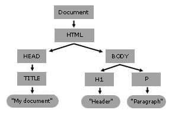

# document object

- [document object](#document-object)
  - [dom fundamentals](#dom-fundamentals)
    - [dom tree](#dom-tree)
  - [accessing dom elements](#accessing-dom-elements)
    - [accessing element contents](#accessing-element-contents)
  - [dom event interface](#dom-event-interface)
    - [event target interface](#event-target-interface)
    - [types of events](#types-of-events)
    - [accessing css properties](#accessing-css-properties)
    - [dom node manipulation](#dom-node-manipulation)
  - [interfaces](#interfaces)
    - [element interface](#element-interface)
    - [htmlcollection interface](#htmlcollection-interface)
    - [domtokenlist interface](#domtokenlist-interface)
  - [trusted types](#trusted-types)
  - [advanced concepts](#advanced-concepts)
    - [capturing and bubbling](#capturing-and-bubbling)

## dom fundamentals

The [**DOM (Document Object Model)**](https://developer.mozilla.org/en-US/docs/Web/API/Document_Object_Model) is an **API** that represents and interacts with any HTML or XML-based markup language document. The DOM is a document model loaded in the browser and representing the document as a **node tree**, or **DOM tree**, where each node represents part of the document (e.g., an element, text string, or comment).

### dom tree

A DOM tree is a tree structure whose nodes represent an HTML or XML document's contents. Each HTML or XML document has a DOM tree representation. For example, consider the following document:

```html
<html lang="en">
  <head>
    <title>My Document</title>
  </head>
  <body>
    <h1>Header</h1>
    <p>Paragraph</p>
  </body>
</html>
```

would have a DOM tree that looks like this:



When a web browser parses an HTML document, it builds a DOM tree and then uses it to display the document.

## accessing dom elements

- `getElementById()`: Returns an Element object representing the element whose id property matches the specified string.
- `getElementsByClassName()`: Returns an array-like object of all child elements which have all of the given class name(s).
- `getElementsByTagName()`: Returns a live `HTMLCollection` of elements with the given tag name.
- `querySelector()`: Returns the first `Element` within the document that matches the specified CSS selector, or group of CSS selectors. If no matches are found, `null` is returned
- `querySelectorAll()`: returns a static (not live) `NodeList` representing a list of the document's elements that match the specified group of selectors.

### accessing element contents

You can use 3 properties to load element contents:

- `<element>.innerText`: What's displayed on the windows. Does not bring you `display:none`
- `<element>.innerHTML`: **DON'T USE IT** unless you are working with proved-to-be-safe `String`s. Injection sink. Brings all there is.
- `<element>.textContent`: Represents the text content of the node and its descendants.

`innerText` gives you Human readable parts. `textContent` gives you everything including `<script>` and `<style>` elements and `hidden` contents.

To modify them, you can simply assign the properties new values. Note that assigning new values will wipe existing ones. Use `insertAdjacentHTML()`(possible XSS) if you want to simply add rather than rebuild.

For objects, change their `src`:

```js
image.src = "new/path"
```

## dom event interface

The `Event` interface represents an event which takes place on an `EventTarget`.

Properties:

- `altKey`:
- `button`:
- `charCode`:
- `clientX`:
- `clientY`:
- `ctrlKey`:
- `pageX`:
- `pageY`:
- `screenX`:
- `screenY`:
- `shiftKey`:
- `target`:
- `timestamp`:
- `type`:
- `which`:

Methods:

- `preventDefault()`:

### event target interface

The `EventTarget` interface is implemented by objects that can receive events and may have listeners for them. In other words, any target of events implements the three methods associated with this interface. Common targets are `Element`, or its children, `Document`, and `Window`, but the target may be any object that supports events (such as `IDBRequest`).

The [`addEventListener()`](https://developer.mozilla.org/en-US/docs/Web/API/EventTarget/addEventListener) method of the `EventTarget` interface sets up a function that will be called whenever the specified event is delivered to the target.

`EventTarget()` constructor can be used to create a new `EventTarget` object instance.

### types of events

`DOMContentLoaded` event fires when the HTML document has been completely parsed, and all deferred scripts (`<script defer src="…">` and `<script type="module">`) have downloaded and executed. It doesn't wait for other things like images, subframes, and async scripts to finish loading.

### accessing css properties

`document.<element-name>.style.<property-name>`

```js
document.querySelector("#desc").style.color = "blue";
```

### dom node manipulation

**Node list**

To [add element nodes](./03-document-object/create-element.js):

- `createElement()`: Creates a new HTMLElement that has the specified localName.
- `createTextNode()`: Creates a new Text node. This method can be used to escape HTML characters
- `appendChild()`: Adds a node to the end of the list of children of a specified parent node.

To delete node, use `<node>.remove()`.

## interfaces

### element interface

For methods below, the `position` property is string representing the position relative to the element. Must be one of the following strings:

- `"beforebegin"`: Before the element. Only valid if the element is in the DOM tree and has a parent element.
- `"afterbegin"`: Just inside the element, before its first child.
- `"beforeend"`: Just inside the element, after its last child.
- `"afterend"`: After the element. Only valid if the element is in the DOM tree and has a parent element.

Methods:

- `insertAdjacentHTML()`: 
    
    ```javascript
    insertAdjacentHTML(position, input)
    ```

    - `input`: A `TrustedHTML` instance or string defining the HTML or XML to be parsed.

- `insertAdjacentElement()`:

    ```javascript
    insertAdjacentElement(position, element)
    ```

    - `element`: The element to be inserted into the tree.

### htmlcollection interface

### domtokenlist interface

`DOMTokenList` interface represents a set of space-separated tokens. Such a set is returned by `Element.classList` or `HTMLLinkElement.relList`, and many others.

`DOMTokenList` Methods:

- `add()`:
- `remove()`:
- `replace()`: Replaces an existing token with a new token. If the first token doesn't exist, `replace()` returns false immediately, without adding the new token to the token list.
- `toggle()`: Removes an existing token from the list and returns `false`. If the token doesn't exist it's added and the function returns `true`.

    ```js
    toggle(token)
    toggle(token, force)
    ```

- `contains()`:

The read-only `classList` property of the `Element` interface contains a live DOMTokenList collection representing the class attribute of the element. This can then be used to manipulate the class list. Using `classList` is a convenient alternative to accessing an element's list of classes as a space-delimited string via `element.className`.

[classList examples](./03-document-object/classlist.js)


## trusted types

The **Trusted Types API** gives web developers a way to ensure that input has been passed through a user-specified transformation function before being passed to an API that might execute that input. This can help to protect against client-side cross-site scripting (XSS) attacks. Most commonly the transformation function sanitizes the input.

Client-side, or DOM-based, XSS attacks happen when data crafted by an attacker is passed to a browser API that executes that data as code. These APIs are known as **injection sinks**.

## advanced concepts

### capturing and bubbling

[a](https://javascript.info/bubbling-and-capturing)
