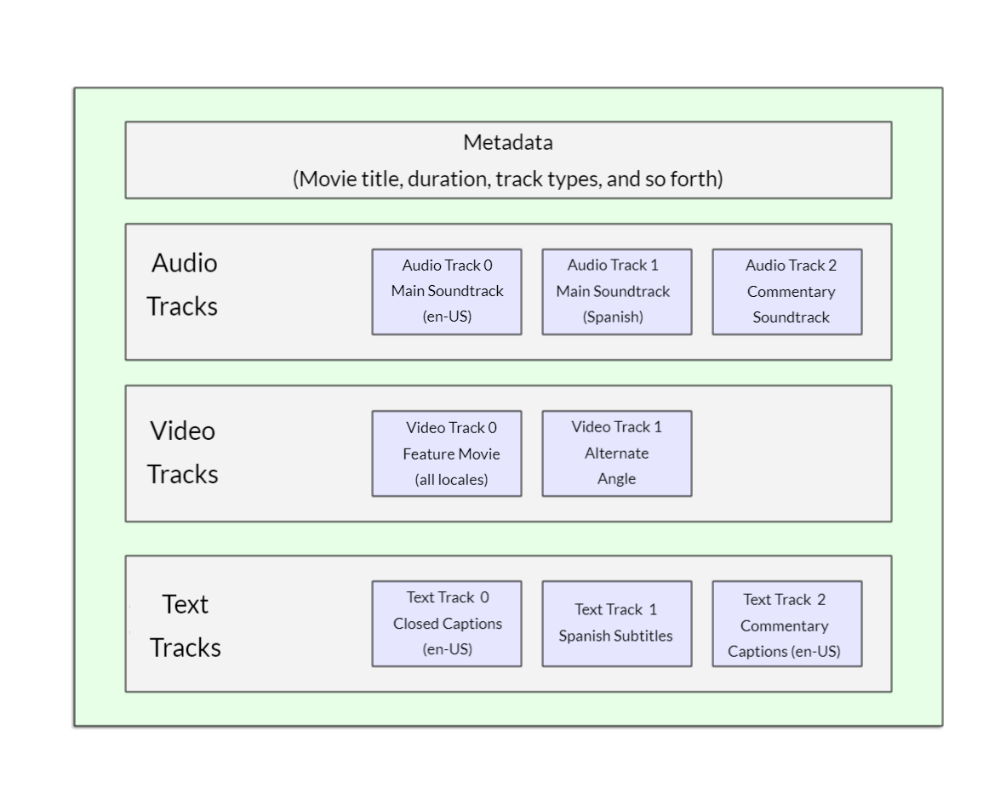

# media file

- [media file](#media-file)
  - [codecs](#codecs)
  - [contents of media file](#contents-of-media-file)
  - [media support in browsers](#media-support-in-browsers)
  - [video text tracks](#video-text-tracks)

## codecs

The codecs exist to compress video and audio into manageable files, since raw audio and video are both exceedingly large. Each web browser supports an assortment of codecs, like Vorbis or H.264, which are used to convert the compressed audio and video into binary data and back.

## contents of media file

[MDN reference](https://developer.mozilla.org/en-US/docs/Learn_web_development/Core/Structuring_content/HTML_video_and_audio#using_multiple_source_formats_to_improve_compatibility)



Formats like OGG, WAV, MP4 and WebM are called container formats. They define a structure in which the audio and/or video tracks that make up the media are stored, along with metadata describing the media, what codecs are used to encode its channels, and so forth.

The audio and video tracks within the container hold data in the appropriate format for the codec used to encode that media. Different browsers support different video and audio formats, and different container formats

- A WebM container typically packages Vorbis or Opus audio with VP8/VP9 video. This is supported in all modern browsers, though older versions may not work.
- An MP4 container often packages AAC or MP3 audio with H.264 video. This is also supported in all modern browsers.

For some types of audio, a codec's data is often stored without a container, or with a simplified container. Examples include:

- **FLAC**: FLAC codecs are stored mostly in FLAC files, which are just raw FLAC tracks.
- **MP3**: Enconded using MPEG-1 Audio Layer III compression.

## media support in browsers

Several popular formats, such as MP3 and MP4/H.264, are excellent but are encumbered by patents.

In order to maximize the likelihood that your website or app will work on a user's browser, you may need to provide each media file you use in multiple formats. If your site and the user's browser don't share a media format in common, your media won't play.

- [Choosing the right container](https://developer.mozilla.org/en-US/docs/Web/Media/Guides/Formats/Containers#choosing_the_right_container)
- [Choosing the right video codec](https://developer.mozilla.org/en-US/docs/Web/Media/Guides/Formats/Video_codecs#choosing_a_video_codec)
- [Choosing the right audiio codec](https://developer.mozilla.org/en-US/docs/Web/Media/Guides/Formats/Audio_codecs#choosing_an_audio_codec)

One additional thing to keep in mind: mobile browsers may support additional formats not supported by their desktop equivalents, just like they may not support all the same formats the desktop version does. On top of that, both desktop and mobile browsers may be designed to offload handling of media playback (either for all media or only for specific types it can't handle internally). This means media support is partly dependent on what software the user has installed.

Including **WebM** and **MP4** sources should be enough to play your video on most platforms and browsers these days.

## video text tracks

Many people can't or don't want to hear the audio/video content they find on the Web. We use the **WebVTT** file format and the `<track>` element.

WebVTT is a format for writing text files containing multiple strings of text along with metadata such as the time in the video at which each text string should be displayed, and even limited styling/positioning information. These text strings are called cues, and there are several kinds of cues which are used for different purposes. The most common cues are:

- Subtitles: Translations of foreign material
- Captions: Synchronized transcriptions of dialog or descriptions of significant sounds, to let people who can't hear the audio understand what is going on.
- Timed descriptions: Text which should be spoken by the media player in order to describe important visuals to blind or otherwise visually impaired users.

A typical vtt file would look like this:

```
WEBVTT

1
00:00:22.230 --> 00:00:24.606
This is the first subtitle.

2
00:00:30.739 --> 00:00:34.074
This is the second.

…
```

To get this displayed along with the HTML media playback, you need to:

1. Save it as a `.vtt` file somewhere the server can serve.
2. Link to the .vtt file with the `<track>` element. `<track>` should be placed within `<audio>` or `<video>`, but after all `<source>` elements. Use the kind attribute to specify whether the cues are `subtitles`, `captions`, or `descriptions`. Further, use `srclang` to tell the browser what language you have written the subtitles in. Finally, add `label` to help readers identify the language they are searching for.
